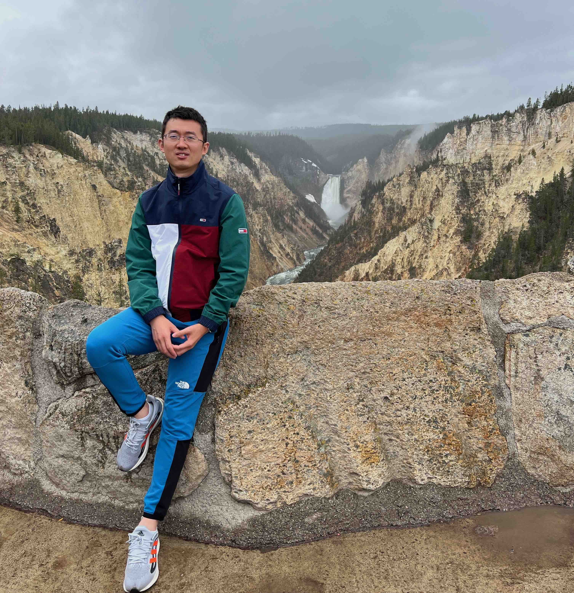

**PhD candidate** in Dept of ECE at **University of Southern California (USC)**.

[`Scholar`](https://scholar.google.com/citations?user=J7vQ-QEAAAAJ&hl=en) ---
[`Linkedin`](https://www.linkedin.com/in/yue-niu-a3084216a/) ---
[`Github`](https://github.com/yuehniu) ---
[`CV`](https://drive.google.com/file/d/1kSlH8tRNY-JdNR_AdII9WraQwunO0BwR/view?usp=sharing)

## Bio  
  Yue (Julien) Niu is a Ph.D. candidate at the University of Southern California (USC), 
  working with Professor [Salman Avestimehr](https://www.avestimehr.com/), 
  the director of [Information Theory and Machine Learning (vITAL) Lab](https://www.avestimehr.com/vital-lab). 
  He also once worked with Professor [Viktor Prasanna](https://sites.usc.edu/prasanna/) 
  on [FPGA/Parallel Computing Lab](https://fpga.usc.edu/). 
  Before that, He got master’s and bachelor’s degree from Northwestern Polytechnical University in Xi’an, China.
  
  His research interests cover various aspects of `privacy in machine learning`, 
  including applying information theory and differential privacy 
  to enhance privacy protection in machine learning, federated learning, and 
  combining with TEEs to boost privacy protection in practice. 
  He also did research on `neural network acceleration` at the edge

---
  
## Research Highlight

  - **Efficient Private Machine Learning in TEE**

    Model training or inference in TEEs, though provides strong privacy protection, 
    suffers significant performance degradation compared to commonly used DNN libraries using GPUs. 
    His work AsymML and [3LegRace](https://arxiv.org/abs/2110.01229) 
    is aimed to shrink the performance gap by leveraging both TEEs and GPUs, 
    where GPUs are used to guarantee computing performance, and TEEs are used to preserve privacy.

  - **Federated Learning at the Edge**
  
    Federated learning of large models at the edge faces significant challenges 
    in terms of computation, communication, and memory costs. 
    As a result, many edge devices, such as smart home assistants, though rich in data, 
    cannot leverage large models to improve their performance. 
    In his work, [PriSM](https://arxiv.org/abs/2208.13141), 
    he proposes sub-model training methods that effectively decompose 
    a large model and assign each client a sub-model during training.

  - **Differential Privacy in Machine Learning**

    Differential privacy (DP) provides a formal quantitative metric to measure privacy leakage 
    against attackers. However, DP usually suffers notable performance loss with 
    a high privacy budget. In his paper [3LegRace](https://arxiv.org/abs/2110.01229), 
    he combines improves DP’s performance 
    by combining with TEEs, e.g., Intel SGX. By first decomposing input data into 
    trusted and untrusted parts and securing trusted parts in TEEs, 
    a very small noise is required to be added into the untrusted part to 
    provide a strong privacy guarantee.

  - **Neural Network Acceleration**

    He also proposed several novel parallel architectures to accelerate neural network computation. 
    In one of his works, he first downsizes a model using its low-rank approximation and 
    then designs architecture in FPGA to efficiently support real-time inference. 
    He also proposes SPEC2 to compress and accelerate a NN model in the frequency domain.

---

## News

--- `July 2023` ---

Our paper, "mL-BFGS: A Momentum-based L-BFGS for Distributed Large-scale Neural Network Optimization",
is accepted to Transaction on Machine Learning Research (TMLR), 2023.

 

Our paper, "Performance and Failure Cause Estimation for Machine Learning Systems in the Wild", 
is accepted to International Conference on Computer Vision Systems (ICVS), 2023

---

## Experience

**Applied Scientist Intern** at *Amazon Alexa* 
`2022/6` --- `2022/9`  
`Topic`: Estimate a CV model’s performance in the wild  
`Collaborator`: Furqan Khan, Pradeep Natarajan, Ruoxi Liu

**Applied Scientist Intern** at *Amazon Alexa* 
`2021/6` --- `2021/9`  
`Topic`: Personalized model compression using knowledge distillation  
`Collaborator`: Furqan Khan, Pradeep Natarajan, Salman Avestimehr

**Research Intern** at *Tsinghua University* 
`2017/6` --- `2018/6`  
`Topic`: Neural network acceleration on FPGA  
`Collaborator`: Zhenyu Liu, Xiangyang Ji  
[`Demo`](https://youtu.be/eFW8OTIur38) --- [`Paper`](https://ieeexplore.ieee.org/abstract/document/8309067)

---

## Academic Service

**Peer Reviewer**: 

`ICLR` --- 2022(2) --- 2021(2)

`NeurIPS` --- 2023(6) --- 2022(4)

`ICML` --- 2023(4)

`KDD` --- 2023 (3)

---

## Awards

**Best Poster Award** at [USC-Amazon Annual Symposium on Secure and Trusted ML](https://trustedai.usc.edu/),
Los Angeles, 2023.