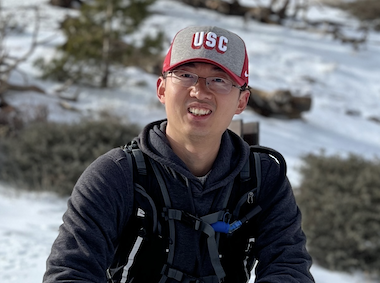

**PhD candidate** in Department of ECE 

at **University of Southern California (USC)**.

<a href="https://scholar.google.com/citations?hl=en&user=J7vQ-QEAAAAJ&view_op=list_works&sortby=pubdate" class="btn">Scholar</a>
[`Linkedin`](https://www.linkedin.com/in/yue-niu-a3084216a/) ---
[`Github`](https://github.com/yuehniu) ---
[`CV`](https://drive.google.com/file/d/1XTzdmqfl43eJ52Pp2tGmOzvG3lF3j9Xs/view?usp=share_link)

## Bio  
  Yue (Julien) Niu is a Ph.D. candidate at the University of Southern California (USC), 
  working with Professor [Salman Avestimehr](https://www.avestimehr.com/), 
  the director of [Information Theory and Machine Learning (vITAL) Lab](https://www.avestimehr.com/vital-lab). 
  He also once worked with Professor [Viktor Prasanna](https://sites.usc.edu/prasanna/) 
  in [FPGA/Parallel Computing Lab](https://fpga.usc.edu/). 
  Before that, He got his master’s and bachelor’s degree from Northwestern Polytechnical University in Xi’an, China.
  
  His research interests cover various aspects of  efficient privacy-preserving machine learning 
  using information 
  theory, differential privacy, federated learning, and distributed setting with private and public environments.
  He is also conducting research on  deep learning and language model acceleration , 
  which reduce training and inference costs using 
  quantization, pruning and low-rank compression.

---
  
## Research Highlight

  - **Efficient Private Machine Learning**

    - Privacy, bias, and fairness in language models
    
    - Differentially private machine learning with improved model utility

    - Private machine learning empowered by trusted execution environment

  - **CNN/Transformer/LLM Acceleration**

    - Fast training and inference via low-rank models and low-rank activation
    
    - Memory-efficient training and inference via low-rank and sparse compression
    
    - Accelerate neural networks with dedicated hardware

  - **Federated Learning at the Edge**
  
    - Federated learning of large models at resource-constrained devices
    
    - Communication-efficient federated learning with sparse training on clients

  - **Efficient High-Order Stochastic Optimization**
    
    - Distributed large-scale model training with quasi-Newton optimization

---

## News

**2024/2/26**: Our paper, All Rivers Run to the Sea: Private Learning with Asymmetric Flows ,
has been accepted to IEEE / CVF Computer Vision and Pattern Recognition Conference (CVPR), 2024.

**2024/2/21**: I will be attending ITA, 2024 
and present our work,  All Rivers Run To The Sea: Private Learning with Asymmetric Flows .

**2024/1/31**: Our paper,  Edge Private Graph Neural Networks with Singular Value Perturbation ,
is accepted to Privacy Enhancing Technologies Symposium (PETs), 2024.

---

## Experience

**Applied Scientist Intern** at *Amazon Alexa* 
`2022/6` --- `2022/9`  
`Topic`: Estimate a CV model’s performance in the wild  
`Collaborator`: Furqan Khan, Pradeep Natarajan, Ruoxi Liu  
[`Paper`](https://link.springer.com/chapter/10.1007/978-3-031-44137-0_31) --- 
[`Media`](https://assets.amazon.science/1e/f2/d7bb807546598add1de82b627043/performance-and-failure-cause-estimation-for-machine-learning-systems-in-the-wild.pdf)

**Applied Scientist Intern** at *Amazon Alexa* 
`2021/6` --- `2021/9`  
`Topic`: Personalized model compression using knowledge distillation  
`Collaborator`: Furqan Khan, Pradeep Natarajan, Salman Avestimehr

**Research Intern** at *Tsinghua University* 
`2017/6` --- `2018/6`  
`Topic`: Neural network acceleration on FPGA  
`Collaborator`: Zhenyu Liu, Xiangyang Ji  
[`Demo`](https://youtu.be/eFW8OTIur38) --- [`Paper`](https://ieeexplore.ieee.org/abstract/document/8309067)

---

## Academic Service

**Conference Reviewer**: 

ICLR --- 2022(2) --- 2021(2)

NeurIPS --- 2023(6) --- 2022(4)

ICML --- 2024(6) --- 2023(4)    

KDD --- 2023 (3)    

SDM --- 2024 (3)

**Journal Reviewer**:

IEEE Transactions on Network Science and Engineering --- 2024 (1)

Transactions on Mobile Computing --- 2023 (1)

**Teaching**:

Introduction to Digital Circuits --- Spring 2020 --- Fall 2019

---

## Awards

**Best Poster Award** at [USC-Amazon Annual Symposium on Secure and Trusted ML](https://trustedai.usc.edu/)  
Los Angeles, 2023.