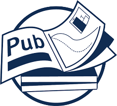

## Publications

**2024**

---

**Yue Niu**, Ramy E. Ali, Saurav Prakash, Salman Avestimehr,  
<u>All Rivers Run to the Sea: Private Learning with Asymmetric Flows</u>,  
`IEEE / CVF Computer Vision and Pattern Recognition Conference (CVPR)`, 2024.  
[`Paper`](https://arxiv.org/pdf/2312.05264.pdf)

Tingting Tang\*, **Yue Niu\***, Salman Avestimehr, Murali Annavaram,  
<u>Edge Private Graph Neural Networks with Singular Value Perturbation</u>,  
`Privacy Enhancing Technologies Symposium (PETs)`, 2024.

Lei Gao\*, **Yue Niu\***, Tingting Tang, Murali Annavaram, Salman Avestimehr,  
<u>Ethos: Rectifying Language Models in Orthogonal Parameter Space</u>,  
`AAAI workshop on Responsible Language Model (ReLM)`, 2024 (**Spotlight**)  
[`Workshop`](https://sites.google.com/vectorinstitute.ai/relm2024/accepted-papers?authuser=0) ---
[`Paper`](https://drive.google.com/file/d/1hpPtmAx_9I29yyEysav-SfwBJMttT-Nw/view?usp=share_link)

**2023**

---

**Yue Niu**, Saurav Prakash, Souvik Kundu, Sunwoo Lee, Salman Avestimehr,  
<u>Overcoming Resource Constraints in Federated Learning: Large Models Can Be Trained with only Weak Clients</u>,  
`Transaction on Machine Learning Research (TMLR)`, 2023  
[`OpenReview`](https://openreview.net/forum?id=lx1WnkL9fk) ---
[`Paper`](https://openreview.net/pdf?id=lx1WnkL9fk) ---
[`Code`](https://github.com/yuehniu/modeldecomp-fl)

Sara Babakniya, Souvik Kundu, Saurav Prakash, **Yue Niu**, Salman Avestimehr,  
<u>Revisiting Sparsity Hunting in Federated Learning: Why the Sparsity Consensus Matters?</u>,  
`Transaction on Machine Learning Research (TMLR)`, 2023  
[`OpenReview`](https://openreview.net/forum?id=iHyhdpsnyi&referrer=%5BAuthor%20Console%5D(%2Fgroup%3Fid%3DTMLR%2FAuthors%23your-submissions)) ---
[`Paper`](https://openreview.net/pdf?id=iHyhdpsnyi) ---
[`Code`](https://github.com/SaraBabakN/flash_fl)

**Yue Niu**, Zalan Fabian, Sunwoo Lee, Mahdi Soltanolkotabi, Salman Avestimehr,  
<u>mL-BFGS: A Momentum-based L-BFGS for Distributed Large-scale Neural Network Optimization</u>,  
`Transaction on Machine Learning Research (TMLR)`, 2023  
[`OpenReview`](https://openreview.net/forum?id=9jnsPp8DP3&referrer=%5BAuthor%20Console%5D(%2Fgroup%3Fid%3DTMLR%2FAuthors%23your-submissions)) --- 
[`PDF`](https://arxiv.org/abs/2307.13744) ---
[`Code`](https://github.com/yuehniu/mL-BFGS)

Xiruo Liu, Furqan Khan, **Yue Niu**, Pradeep Natarajan, Rinat Khaziev, Salman Avestimehr, Prateek Singhal,  
<u>Performance and Failure Cause Estimation for Machine Learning Systems in the Wild</u>,  
`Conference on Computer Vision Systems (ICVS)`, 2023  
[`Paper`](https://link.springer.com/chapter/10.1007/978-3-031-44137-0_31) --- 
[`Amazon Science Report`](https://www.amazon.science/publications/performance-and-failure-cause-estimation-for-machine-learning-systems-in-the-wild)  
(work done during internship at Amazon Alexa in 2022)

**2022**

---

**Yue Niu**, Ramy E. Ali, Salman Avestimehr,  
<u> 3LegRace: Privacy-Preserving DNN Training over TEEs and GPUs</u>,  
`Privacy Enhancing Technologies Symposium (PETs)`, 2022  
[`Paper`](https://petsymposium.org/popets/2022/popets-2022-0105.pdf) --- 
[`Code`](https://github.com/yuehniu/asymmetricML) --- 
[`Video`](https://www.youtube.com/watch?v=AlnCVAe-mHg&t=2s)

**Yue Niu**,  Saurav Prakash, Souvik Kundu, Sunwoo Lee, Salman Avestimehr,  
<u> Federated Learning of Large Models at the Edge via Principal Sub-Model Training</u>,  
`International Workshop on Federated Learning in Conjunction with NeurIPS`, 2022  
[`Paper`](https://arxiv.org/abs/2208.13141) ---
[`Link`](https://federated-learning.org/fl-neurips-2022/)

Sara Babakniya, Souvik Kundu, Saurav Prakash, **Yue Niu**, Salman Avestimehr,  
<u> Federated sparse training: Lottery aware model compression for resource-constrained edge</u>,  
`International Workshop on Federated Learning in Conjunction with NeurIPS`, 2022  
[`Paper`](https://arxiv.org/abs/2208.13092) ---
[`Link`](https://federated-learning.org/fl-neurips-2022/)

**2021**

---

**Yue Niu**, Salman Avestimehr,  
<u>AsymmetricML: An Asymmetric Decomposition Framework for Privacy-Preserving DNN Training and Inference </u>,  
`ICLR Workshop on Distributed and Private Machine Learning`, 2021.  
[`Paper`](https://petsymposium.org/popets/2022/popets-2022-0105.pdf) --- 
[`Link`](https://dp-ml.github.io/2021-workshop-ICLR/)

**Yue Niu**, Zalan Fabian, Sunwoo Lee, Mahdi Soltanolkotabi, Salman Avestimehr,  
<u>SLIM-QN: A Stochastic, Light, Momentumized Quasi-Newton Optimizer for Deep Networks</u>,  
`ICML Workshop on the Optimization`, 2021  
[`Paper`](https://arxiv.org/abs/2307.13744) --- 
[`Link`](https://sites.google.com/view/optml-icml2021)

**2020**

---

**Yue Niu**, Rajgopal Kannan, Ajitesh Srivastava, Viktor Prasanna,  
<u>Reuse Kernels or Activations? A Flexible Dataflow for Low-latency Spectral CNN Acceleration</u>,  
`ACM/SIGDA International Conference on Field-Programmable Gate Arrays (FPGA)`, (**Oral**), 2020

**Yue Niu**, Hanqing Zeng, Ajitesh Srivastava, Kartik Lakhotia, Rajgopal Kannan, Yanzhi Wang, Viktor Prasanna,  
<u>SPEC2: SPECtral SParsE CNN Accelerator on FPGAs</u>,  
`IEEE International Conference on High Performance Computing (HiPC)` (**Oral**), 2020.

**Before 2020**

---

Wei Zhou, **Yue Niu**, Guanwen Zhang,  
<u>Sensitivity-oriented layer-wise acceleration and compression for convolutional neural network</u>,  
`IEEE Access`, 2019. 

Chunsheng Mei, Zhenyu Liu, **Yue Niu**, Xiangyang Ji, Wei Zhou, Dongsheng Wang,  
<u>A 200MHZ 202.4GFLOPS@10.8W VGG16 Accelerator in XILINX VX690T</u>,  
`IEEE Global Conference on Signal and Information Processing (GlobalSIP)` (**Oral**), 2017.

**Yue Niu**, Chunsheng Mei, Zhenyu Liu, Xiangyang Ji, Wei Zhou, Dongsheng Wang,  
<u>Sensitivity-Based Acceleration and Compression Algorithm for Convolutional Neural Network</u>,  
`IEEE Global Conference on Signal and Information Processing (GlobalSIP)` (**Oral**), 2017. 

**Yue Niu**, Wei Zhou, Xiaocong Lian, Xin Zhou, Jiamin Yang,  
<u>A Stepped-RAM Reading and Multiplierless VLSI Architecture for Intra Prediction in HEVC</u>,  
`The Pacific-Rim Conference on Multimedia (PCM)`, 2016

[back](./)
