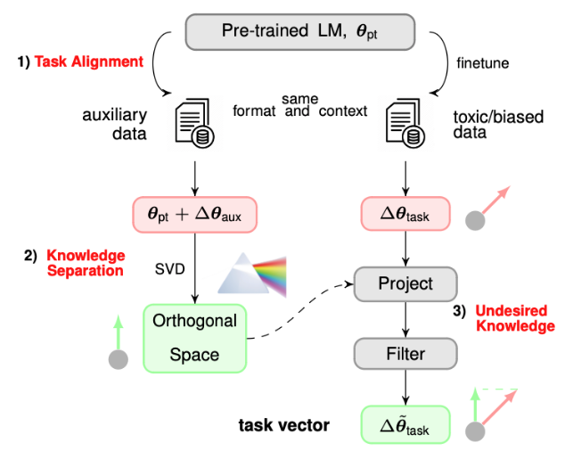
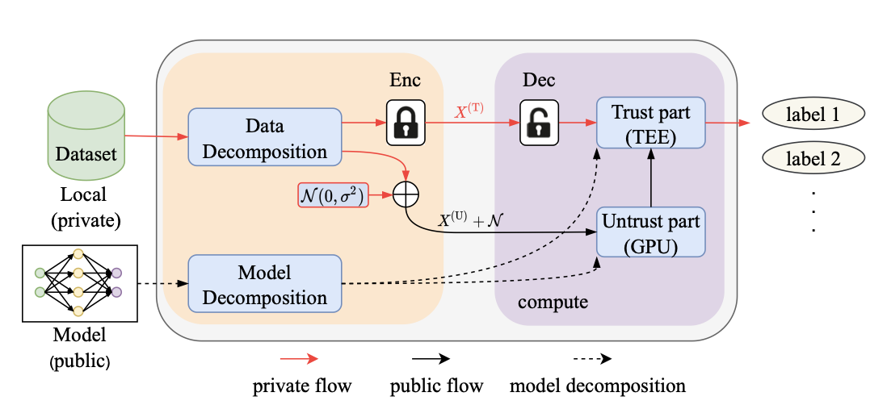
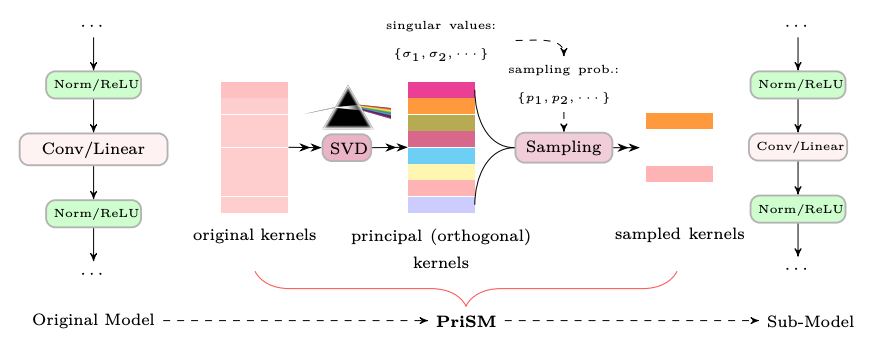
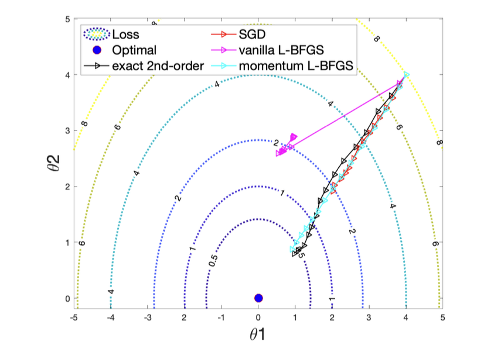

## Research

---

### LLM Alignment with Model Editing
Collaborated with 
Lei Gao,
Tingting Tang,
[Salman Avestimehr](https://scholar.google.com/citations?user=Qhe5ua0AAAAJ&hl=en),
Murali Annavaram

In this project, we aim to align and rectify language model, 
and reduce potential bias, toxic information, privacy leakage.
We first analyze model weights in an orthogonal space and identify the part that 
encode undesired knowledge.
Then we directly edit a pre-trained model and remove weights that encode undesirable knowledge
such as bias and toxic information.  
`Read More ...`

---

### Asymmetric Learning for Privacy-Preserving ML  
Collaborated with 
[Ramy E. Ali](https://scholar.google.com/citations?user=FLJ86DwAAAAJ&hl=en),
[Saurav Prakash](https://sauravpr.com),
[Salman Avestimehr](https://scholar.google.com/citations?user=Qhe5ua0AAAAJ&hl=en)

In this project, we explore a new privacy-preserving learning and inference framework: private learning with asymmetric
data flows. 
We show that exploring low-rank structure of **data** in machine learning is very important in terms of complexity 
reduction and privacy protection. 
Along this line of research, we leverage low-rank structure of data and propose asymmetric learning framework that
achieves privacy-preserving model learning and inference.  
[`Read More ... `](_posts/2024-04-03-asymml.md)

---

### Federated Learning at the Resource-Constrained Edge  
Collaborated with 
[Saurav Prakash](https://scholar.google.com/citations?user=VhnTrugAAAAJ&hl=en),
[Souvik Kundu](https://scholar.google.com/citations?user=b591SVkAAAAJ&hl=en),
[Sunwoo Lee](https://scholar.google.com/citations?user=WA9KNNcAAAAJ&hl=en),
[Salman Avestimehr](https://scholar.google.com/citations?user=Qhe5ua0AAAAJ&hl=en)

Federated learning of large neural nets at the edge faces significant challenges due to
the limited computation and memory on-device resources. 
**Sub-model** training methodology presents a promising solution.
We investigate a new sub-model training method that reduces computations at the edge while still attaining a full model.  
[`Read More ... `](_posts/2023-07-29-prism.md)

---

### High-Order Optimization on Large-Scale NN Training
Collaborated with 
[Zalan Fabian](https://scholar.google.com/citations?hl=en&user=5EKjsXQAAAAJ),
[Sunwoo Lee](https://scholar.google.com/citations?user=WA9KNNcAAAAJ&hl=en),
[Mahdi Soltanolkotabi](https://scholar.google.com/citations?hl=en&user=narJyMAAAAAJ),
[Salman Avestimehr](https://scholar.google.com/citations?user=Qhe5ua0AAAAJ&hl=en)

High-order/Newton methods face significant challenges in current large-model training era, due to 
their quadratic computation and memory complexities. 
In this project, we aim to convey an effective quasi-Newton method, L-BFGS, to large-scale model training.
To address convergence instability of L-BFGS in stochastic optimization, we introduce a momentum to the Hessian approximation.  
[`Read More ... `](_posts/2022-07-29-mlbfgs.md)

---

[back](./)
