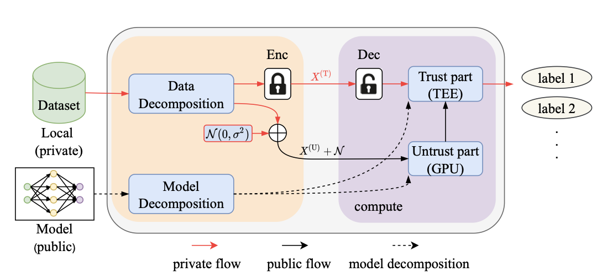

## Research

---

### Asymmetric Learning for Privacy-Preserving ML

Exploring low-rank structure of **data** in machine learning is very important. 
Along this line of research, we leverage low-rank structure of data and propose asymmetric learning framework that
achieves privacy-preserving model learning and inference.  
[`Read More ... `](_research/asymml.md)  

[`Read More ... `](_posts/2016-05-19-super-short-article.md)

---

[back](./)
