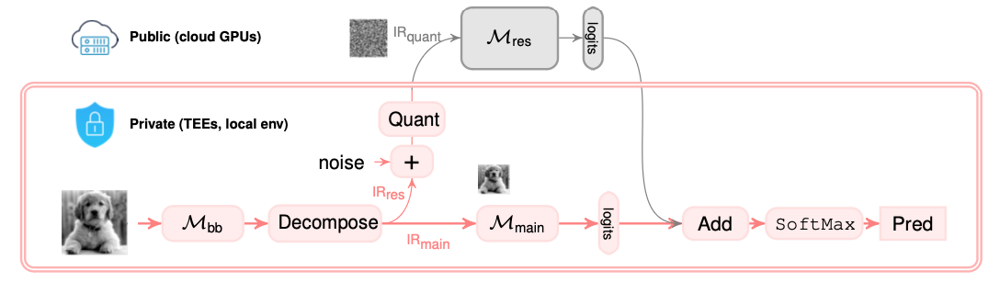

## Research

---

### Asymmetric Learning for Privacy-Preserving ML  
Collaborated with 
[Ramy E. Ali](https://scholar.google.com/citations?user=FLJ86DwAAAAJ&hl=en),
[Salman Avestimehr](https://scholar.google.com/citations?user=Qhe5ua0AAAAJ&hl=en)

Exploring low-rank structure of **data** in machine learning is very important. 
Along this line of research, we leverage low-rank structure of data and propose asymmetric learning framework that
achieves privacy-preserving model learning and inference.  
[`Read More ... `](_posts/2022-07-29-asymml.md)

---

### Federated Learning at the Resource-Constrained Edge  
Collaborated with 
[Saurav Prakash](https://scholar.google.com/citations?user=VhnTrugAAAAJ&hl=en),
[Souvik Kundu](https://scholar.google.com/citations?user=b591SVkAAAAJ&hl=en),
[Sunwoo Lee](https://scholar.google.com/citations?user=WA9KNNcAAAAJ&hl=en),
[Salman Avestimehr](https://scholar.google.com/citations?user=Qhe5ua0AAAAJ&hl=en)

Federated learning of large neural nets at the edge faces significant challenges due to
the limited computation and memory on-device resources. 
**Sub-model** training methodology presents a promising solution.
We investigate a new sub-model training method that reduces computations at the edge while still attaining a full model.  
[`Read More ... `](_posts/2022-07-29-prism.md)

---

[back](./)
