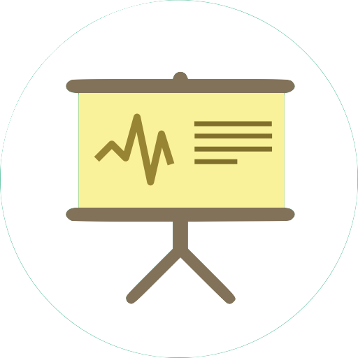

## Talks

**Title**: Efficient ML: From Hardware to Algorithm  
Samsung, San Diego @ **Virtual**, April 11, 2024

<a href="https://yuehniu.github.io/homepage/docs/Samsung_Presentation_YueNiu.pdf" class="btn">Slides</a>

**Title**: Private Learning with Asymmetric Flows
[Information Theory and Applications Workshop](https://ita.ucsd.edu/workshop/)
@ **Bahia Resort, San Diego**, Feb 22, 2024

<a href="https://drive.google.com/file/d/1qHEB-8SMcvrub9inBWjh-wv0oqjVd9v4/view?usp=share_link" class="btn">Slides</a>
<a href="https://drive.google.com/file/d/1udAtljovkWm58wIxg1mR9xpqcFna9sFp/view?usp=share_link" class="btn">Poster</a>

[USC ECE Annual Research Festival Registration](https://minghsiehece.usc.edu/2022-electrical-and-computer-engineering-research-festival/)
@ **USC, Los Angeles**, Oct 27, 2023

<a href="https://docs.google.com/presentation/d/10BI5i7zcZcgMS0DgFvvalxtMlb3DoFXEy9P9S2FLh-Y/edit?usp=share_link" class="btn">Poster</a>

[Information-Theoretic Methods for Trustworthy Machine Learning](https://simons.berkeley.edu/workshops/asu-it-ml/schedule#simons-tabs)
@ **Simons Institute, UC Berkeley**, May 24, 2023

<a href="https://docs.google.com/presentation/d/1KppYUn7NZYr2lnXMbDIHdFW3yBnbz08e/edit?usp=share_link&ouid=109203633834170149669&rtpof=true&sd=true" class="btn">Poster</a>

[Second Annual Symposium of USC-Amazon Center](https://trustedai.usc.edu/second-annual-symposium)
@ **USC, Los Angeles**, April 28, 2023

<a href="https://docs.google.com/presentation/d/1iWEHa8XBSiTxwLIUIM4a2GJ8FCvnN4Jk/edit?usp=share_link&ouid=109203633834170149669&rtpof=true&sd=true" class="btn">Poster</a>

36th Conference on Neural Information Processing Systems (NeurIPS)
@ **New Orleans, US**, Dec 5, 2022

<a href="https://docs.google.com/presentation/d/10BI5i7zcZcgMS0DgFvvalxtMlb3DoFXEy9P9S2FLh-Y/edit?usp=share_link" class="btn">Poster</a>

22nd Privacy Enhancing Technologies Symposium (PETS 2022)
@ **Sydney, Australia**, July 11-15, 2022

<a href="https://youtu.be/AlnCVAe-mHg?si=wpkIpxlABwSURdzv" class="btn">Poster</a>
<a href="https://docs.google.com/presentation/d/1acwydVVgOOusUnoZ8IJedZACrR8ubnlb/edit?usp=share_link&ouid=109203633834170149669&rtpof=true&sd=true" class="btn">Slides</a>

---

[back](./)
